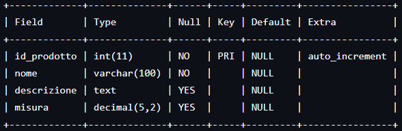
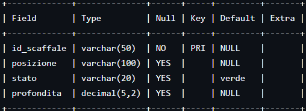
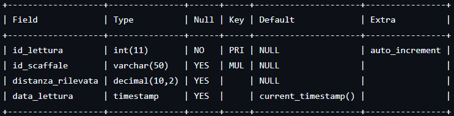
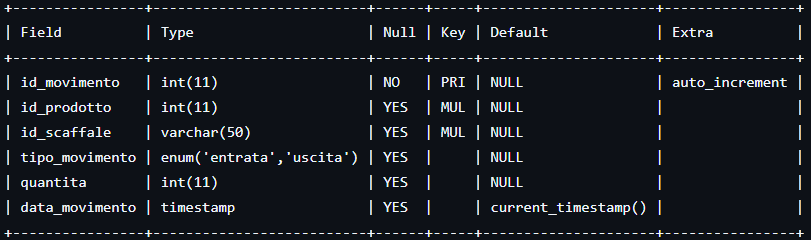
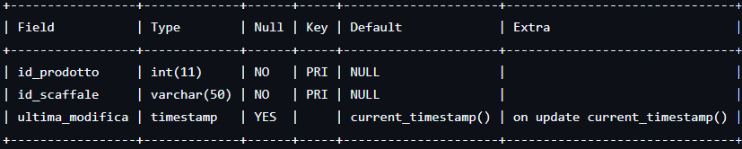
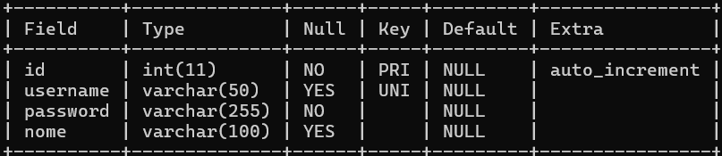

## Schema ER MYSQL:
 - Tabella prodotti: 
	Dati generali, anagrafica degli articoli nel sistema

	id_prodotto (INT): Identificativo univoco e numerico del prodotto. Viene incrementato automaticamente dal database a ogni nuovo inserimento, garantendo 		l'assenza di duplicati.

	nome (VARCHAR 100): Il nome o titolo identificativo dell'articolo. È un campo obbligatorio con un limite di 100 caratteri.

	descrizione (TEXT): Campo testuale facoltativo e senza limiti stringenti di lunghezza, utilizzato per inserire dettagli aggiuntivi o specifiche	sul prodotto.

	misura (DECIMAL 5,2): Valore numerico decimale opzionale che esprime la dimensione fisica. 	Questo dato è fondamentale per permettere all'algoritmo del 		backend di calcolare matematicamente quanti pezzi sono presenti basandosi sullo spazio residuo rilevato dal sensore IoT.

 - Tabella scaffali: 
	Mappa i punti di stoccaggio fisici all'interno del magazzino

	id_scaffale (VARCHAR 50): Identificativo univoco del singolo scaffale. Essendo chiave primaria, impedisce la creazione di scaffali duplicati nel sistema ed è 	inserito obbligatoriamente.

	posizione (VARCHAR 100): Campo testuale opzionale utilizzato per descrivere la collocazione fisica dello scaffale all'interno dello stabilimento. Se non 		specificato dall'utente, il backend assegna un valore temporaneo di default.

	stato (VARCHAR 20): Indica la condizione di riempimento dello scaffale. Ha un valore predefinito impostato su 'verde' e viene aggiornato automaticamente dal 	sistema in base ai dati ricevuti dai sensori IoT, assumendo valori legati alla logistica di stoccaggio.

	profondita (DECIMAL 5,2): Valore numerico decimale che memorizza la profondità totale espressa in centimetri dello scaffale vuoto. Questo dato è essenziale 	poiché funge da punto di riferimento per l'algoritmo del server il sistema calcola lo spazio occupato dalla merce e determina la quantità di prodotti 			presenti, confrontando la profondità massima con la distanza rilevata dal sensore ultrasonico.

 - Tabella letture_sensore: 
	Tramite il sensore in base alla distanza capiamo quanto è occupato, un registro storico che archivia tutti i dati grezzi trasmessi dai sensori tramite MQTT.

	id_lettura (INT): È un contatore numerico progressivo generato automaticamente dal database per ogni nuova ricezione di dati, utile per indicizzare 			cronologicamente i messaggi del sensore.

	id_scaffale (VARCHAR 50): Memorizza l'identificativo dello scaffale a cui appartiene il sensore che ha trasmesso il dato. La dicitura "MUL" nella colonna 		"Key" indica la presenza di un indice che collega questa tabella alla tabella principale degli scaffali, ottimizzando le query di ricerca dell'ultima lettura.

	distanza_rilevata (DECIMAL 10,2): Il valore numerico inviato dal sensore. Rappresenta lo spazio vuoto misurato dal sensore tra se stesso e il primo ostacolo 	rilevato.

	data_lettura (TIMESTAMP): Indica il momento esatto in cui la lettura viene registrata sul database. Se non specificato, il sistema inserisce in automatico la 	data e l'ora correnti del server, permettendo di tracciare la timeline degli eventi in tempo reale. 

   
- Tabella movimenti: 
	Mostra i vari movimenti effettuati e da quale scaffale vengono eseguiti

	id_movimento (INT): È un identificativo numerico progressivo generato automaticamente che, in modo univoco, cataloga ogni transazione logistica.

	id_prodotto (INT): Memorizza l'identificativo del prodotto coinvolto nell'operazione. La dicitura "MUL" nella colonna "Key" indica un indice che collega il 	movimento all'anagrafica prodotti.

	id_scaffale (VARCHAR 50): Identifica lo scaffale da cui la merce è stata prelevata o in cui è stata depositata. Anche questo campo ha dicitura "MUL" utilizzato per collegare il movimento allo scaffale

	tipo_movimento (ENUM): Campo a scelta obbligata vincolato ai soli valori "entrata" o "uscita" o "errore". Definisce la natura del flusso logistico, dove "errore" identifica le letture anomale (nel caso in cui la lettura sia maggiore della profondità dello scaffale) che non corrisponde ad un reale movimento della merce.

	quantita (INT): Il numero di pezzi movimentati durante la singola operazione. Questo valore viene utilizzato dal backend per aggiornare, per somma o sottrazione, la disponibilità complessiva.

	data_movimento (TIMESTAMP): Registra il momento esatto in cui è avvenuta la transazione. Valorizzato automaticamente dal database con l'ora corrente del server, permette di ricostruire la cronologia dei flussi e alimentare la pagina dello storico delle movimentazioni.

	distanza (DECIMAL 5,2): Registra la distanza rilevata dal sensore (in centimetri) al momento del movimento. Viene salvata insieme a ogni transazione per mantenere traccia della misurazione grezza che ha generato il calcolo della quantità, utile anche per verificare o correggere eventuali anomalie rilevate come "errore".

 - Tabella prodotti_scaffali: 
	Mostra su quale scaffale è posizionato ogni prodotto
	Consente ad ogni scafale di poter avere anche diversi prodotti

	id_prodotto (INT): Memorizza l'identificativo del prodotto. Insieme a "id_scaffale" costituisce una chiave primaria composta. Inoltre è vincolato da un ulteriore indice "UNIQUE" sulla sola colonna id_prodotto, che garantisce che ogni prodotto possa essere associato a un solo scaffale alla volta, quindi se un prodotto viene riassegnato a un nuovo scaffale e la vecchia associazione viene sostituita automaticamente, non duplicata.

	id_scaffale (VARCHAR 50): Memorizza l'identificativo dello scaffale logistico. Funge da vincolo relazionale verso l'anagrafica degli scaffali. A differenza di "id_prodotto", questa colonna non ha vincoli di unicità propri, quindi lo stesso scaffale può comparire in più righe, ospitando prodotti diversi 

	ultima_modifica (TIMESTAMP): Tiene traccia del momento esatto in cui l'associazione è stata creata o modificata. Il database aggiorna automaticamente questo valore in tempo reale ogni volta che la riga viene modificata, senza bisogno di specificarlo manualmente nel codice del backend.

Nelle tabelle "letture_sensore", "movimenti" e "prodotti_scaffali" possiamo notare che nell'ultima riga di ognuno c'è la colonna "current_timestamp()" ciò significa che il database inserisce automaticamente la data e l'ora corrente ogni volta che viene eseguita la query "INSERT".

 - Tabella utenti:
    Gestisce gli account abilitati ad accedere al sistema

id (INT): È un identificativo numerico progressivo generato automaticamente che, in modo univoco, identifica ogni account registrato nel sistema.
username (VARCHAR 50): Il nome utente scelto per l'accesso al sistema. La dicitura "UNI" nella colonna "Key" indica un vincolo di unicità: non possono esistere due account con lo stesso username.
password (VARCHAR 255): Contiene l'hash della password calcolato tramite l'algoritmo bcrypt, non la password in chiaro. La lunghezza di 255 caratteri è dimensionata per ospitare il formato standard degli hash generati da questa libreria, garantendo che le credenziali non siano mai leggibili direttamente dal database.
nome (VARCHAR 100): Campo opzionale che memorizza il nome descrittivo associato all'account, utilizzato eventualmente per identificare l'utente in modo più leggibile rispetto al solo username.

