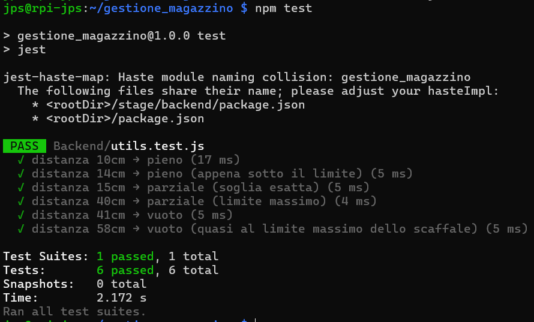

## EXPRESS.JS

`express.js` è il punto di ingresso del server Node.js scritto con il framework Express. Si occupa solo di avviare l'applicazione: configura i middleware globali, collega i moduli delle rotte, avvia il server e fa partire il listener MQTT. La logica vera e propria (connessione al database, singole rotte API, gestione dei messaggi MQTT) è stata suddivisa in file separati per mantenere il progetto leggibile e manutenibile.

Il server, nel suo insieme, svolge tre compiti principali in contemporanea:

- Serve le pagine HTML del frontend;
- Espone un'API REST che il frontend usa per leggere e scrivere dati sul database MariaDB;
- Si connette al broker MQTT Mosquitto per ricevere in tempo reale i dati inviati dall'Arduino tramite Node-RED, elaborarli e salvarli nel database.

### Librerie utilizzate

- **dotenv**: legge le credenziali del database da un file `.env` nascosto, evitando di scrivere password nel codice.
- **express**: framework per creare il server web e definire le API REST.
- **mysql2**: driver per connettersi e fare query su MariaDB.
- **cors**: permette al frontend di fare richieste HTTP al backend anche da origini diverse.
- **express-session**: gestisce le sessioni utente (login/logout).
- **bcrypt**: verifica le password confrontandole con l'hash salvato nel database, senza mai trattarle in chiaro.
- **mqtt**: permette al backend di connettersi al broker Mosquitto e ricevere i messaggi MQTT dall'Arduino.
- **path**: modulo Node.js standard per gestire i percorsi dei file.

### Struttura del progetto

Il backend è organizzato in moduli separati, ciascuno con una responsabilità precisa:

- `express.js` — punto di ingresso: setup, middleware, avvio server e del listener MQTT.
- `db.js` — connessione al database MariaDB.
- `stato.js` — variabili di stato condivise tra le rotte API e il listener MQTT (stato del sensore, ultimo aggiornamento, ultimo errore di payload).
- `routes/auth.js` — login, logout, cambio password, cambio username.
- `routes/prodotti.js` — CRUD dell'anagrafica prodotti.
- `routes/scaffali.js` — CRUD scaffali e associazioni prodotto-scaffale.
- `routes/movimenti.js` — storico movimenti di magazzino.
- `routes/sensori.js` — letture sensori, storico, grafico.
- `routes/sistema.js` — stato del server, stato del sensore, diagnostica.
- `mqtt/listener.js` — ricezione ed elaborazione dei messaggi MQTT provenienti dai sensori.

### Setup e configurazione iniziale

`express.js` carica le variabili d'ambiente dal file `.env`, così le credenziali non sono mai scritte nel codice sorgente, e configura i middleware globali (sessione, CORS, parsing JSON, protezione delle pagine `.html` per gli utenti non autenticati).

### Connessione al database

Gestita da `db.js`: il backend si connette a MariaDB usando le variabili lette da `.env`. La connessione avviene una sola volta all'avvio del server e rimane aperta per tutta la durata dell'esecuzione. Se la connessione fallisce, viene stampato un errore nel terminale ma il server continua ad avviarsi.

### Autenticazione (`routes/auth.js`)

Le pagine `.html` protette (tutte tranne `login.html`, `password.html` e `username.html`) sono accessibili solo con una sessione attiva: senza sessione, il middleware globale in `express.js` reindirizza automaticamente al login.

La rotta `POST /login` verifica che l'username esista nella tabella `utenti`, poi confronta la password inserita con l'hash salvato tramite `bcrypt.compare`. Se corrisponde, crea la sessione e reindirizza a `Inventario.html`; altrimenti reindirizza a `login.html?errore=1`.

Sono presenti anche:
- `POST /api/password` — cambia la password di un utente, verificando la vecchia con `bcrypt.compare` e salvando l'hash della nuova con `bcrypt.hash`.
- `POST /api/username` — cambia lo username di un utente, verificando la password e controllando che il nuovo username non sia già in uso.
- `GET /logout` — distrugge la sessione e reindirizza al login.

### API REST

Ogni rotta riceve una richiesta HTTP, esegue una query e restituisce il risultato in JSON.

Sia `/api/prodotti` che `/api/scaffali` seguono lo stesso schema: GET restituisce l'elenco, POST crea, PUT modifica, DELETE elimina (compresi i dati collegati, come i movimenti di un prodotto o le letture di uno scaffale). La query GET `/api/scaffali` recupera anche l'ultima lettura del sensore e calcola la quantità stimata di prodotto presente.

*Movimenti* (`routes/movimenti.js`): GET restituisce gli ultimi 100 movimenti (filtrabili per scaffale e intervallo di date), POST permette di inserire manualmente un movimento (usato per test, es. con Postman).

*Prodotti-scaffali* (`routes/scaffali.js`): GET mostra i prodotti associati agli scaffali, POST associa un prodotto a uno scaffale (sostituendo automaticamente qualunque altro prodotto già presente su quello scaffale), DELETE rimuove l'associazione.

*Sensore* (`routes/sensori.js`): GET `/api/letture_sensore` restituisce le ultime 5 letture, GET `/api/sensor/latest` restituisce l'ultima lettura per ogni scaffale, GET `/api/sensor/history?n=N` restituisce le ultime N letture, GET `/api/sensor/chart` restituisce le letture delle ultime 24 ore per uno scaffale.

*Sistema* (`routes/sistema.js`): GET `/api/health` verifica la raggiungibilità del database, GET `/api/sensore/stato` restituisce lo stato online/offline del sensore, GET `/api/errore/payload` restituisce l'ultimo errore di parsing MQTT, GET `/api/sensor/timestamp` restituisce il timestamp dell'ultimo aggiornamento.

### Listener MQTT (`mqtt/listener.js`)

Gestisce la comunicazione in tempo reale con l'hardware. Il backend si connette al broker Mosquitto in esecuzione sul Raspberry Pi e si mette in ascolto su tutti i topic del canale `magazzino/#`.

- `classificaStato(distanza)` converte la distanza in cm in un'etichetta leggibile: `pieno`, `parziale` o `vuoto`.
- Ignora i messaggi sul topic `magazzino/monitor` per evitare loop.
- Aggiorna lo stato del sensore (online/offline) quando riceve un messaggio sul topic `magazzino/sensore/stato`.
- Parsifica il payload JSON ricevuto da Node-RED/Arduino.
- Formatta l'ID scaffale nel formato standard (nel nostro caso `S01`).
- Crea lo scaffale nel database se non esiste già.
- Aggiorna lo stato dello scaffale in base alla distanza.
- Scarta le letture duplicate: se una lettura con la stessa distanza per lo stesso scaffale è già stata registrata negli ultimi 3 secondi, viene ignorata.
- Salva la lettura con timestamp automatico.
- Calcola la quantità presente prima e dopo con la formula `FLOOR((profondita - distanza) / misura)`: se la differenza è positiva registra un'entrata, se è negativa registra un'uscita di merce; se invece la distanza supera la profondità dello scaffale o è negativa, registra un movimento di tipo `errore`.
- Se il messaggio include un prodotto, aggiorna automaticamente l'associazione prodotto-scaffale.
- Pubblica un messaggio di conferma su `magazzino/monitor` e, se la quantità è cambiata, un aggiornamento su `magazzino/dashboard` per Node-RED.

### Avvio del server

Il server viene avviato sulla porta 3000, con indirizzo IP definito come costante in `express.js` — entrambi i valori sono attualmente hardcoded nel file, non letti da `.env` (vedi limitazioni note nel README principale).

Per essere sicuri che sia stato fatto nel modo corretto ho estrapolato la funzione 
" classificaStato " dal listener MQTT, creato un nuovo file chiamato " utils.test.js " con 6 casi di test che coprono gli scenari reali del sensore, usato JEST per fare il test e sono tutti andati a buon fine.

